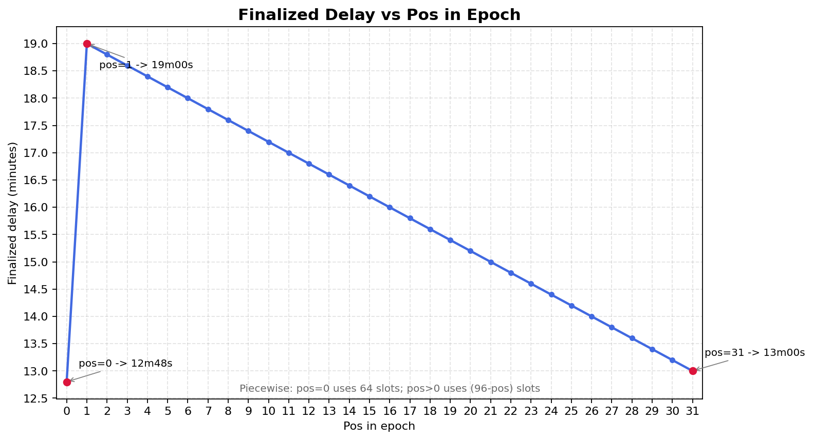
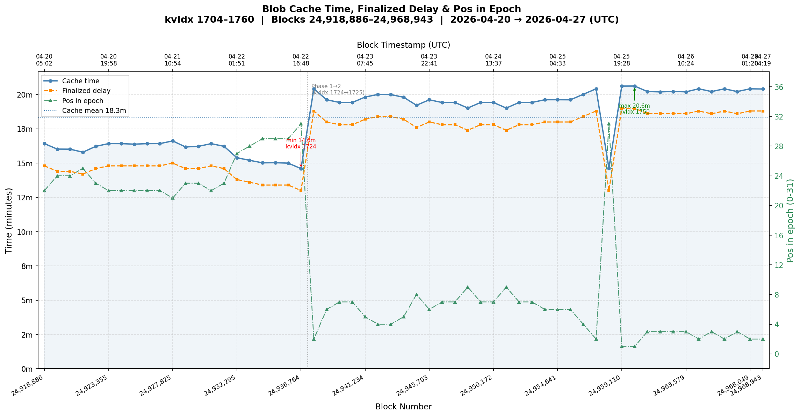

# Blob Cache Time Analysis
**Date:** 2026-04-27  
**Source log:** `es.log` (34,471 lines, Docker container `es`)  

---

## Data summary

| Metric | Value |
|---|---|
| Blobs analyzed | 57 complete + 1 pending (kvIdx 1761) |
| kvIndex range | 1704 – 1761 |
| Block range | 24,918,886 – 24,969,837 |
| Period | 2026-04-20 05:02 UTC → 2026-04-27 07:19 UTC (~7 days) |
| Min cache time | **13m 00s** (kvIdx 1748, pos-in-epoch=31) |
| Max cache time | **20m 37s** (kvIdx 1749 & 1750, pos-in-epoch=1) |
| Mean cache time | **~18m 20s** |

---

## Cache Time Table (from log)

| kvIdx | Downloaded (UTC) | Saved (UTC) | Cache time |
|---|---|---|---|
| 1704 | 2026-04-20 05:02:26 | 2026-04-20 05:18:51 | 16m 25s |
| 1705 | 2026-04-20 08:02:02 | 2026-04-20 08:18:03 | 16m 01s |
| 1706 | 2026-04-20 11:01:14 | 2026-04-20 11:17:15 | 16m 00s |
| 1707 | 2026-04-20 14:00:39 | 2026-04-20 14:16:27 | 15m 47s |
| 1708 | 2026-04-20 16:59:26 | 2026-04-20 17:15:39 | 16m 13s |
| 1709 | 2026-04-20 19:58:26 | 2026-04-20 20:14:51 | 16m 25s |
| 1710 | 2026-04-20 22:57:38 | 2026-04-20 23:14:03 | 16m 25s |
| 1711 | 2026-04-21 01:56:52 | 2026-04-21 02:13:15 | 16m 22s |
| 1712 | 2026-04-21 04:56:02 | 2026-04-21 05:12:27 | 16m 25s |
| 1713 | 2026-04-21 07:55:14 | 2026-04-21 08:11:39 | 16m 25s |
| 1714 | 2026-04-21 10:54:14 | 2026-04-21 11:10:51 | 16m 37s |
| 1715 | 2026-04-21 13:53:52 | 2026-04-21 14:10:03 | 16m 10s |
| 1716 | 2026-04-21 16:53:02 | 2026-04-21 17:09:15 | 16m 13s |
| 1717 | 2026-04-21 19:52:02 | 2026-04-21 20:08:27 | 16m 25s |
| 1718 | 2026-04-21 22:51:26 | 2026-04-21 23:07:39 | 16m 13s |
| 1719 | 2026-04-22 01:51:27 | 2026-04-22 02:06:51 | 15m 23s |
| 1720 | 2026-04-22 04:50:51 | 2026-04-22 05:06:03 | 15m 12s |
| 1721 | 2026-04-22 07:50:14 | 2026-04-22 08:05:15 | 15m 01s |
| 1722 | 2026-04-22 10:49:25 | 2026-04-22 11:04:27 | 15m 01s |
| 1723 | 2026-04-22 13:48:39 | 2026-04-22 14:03:39 | 14m 59s |
| 1724 | 2026-04-22 16:48:15 | 2026-04-22 17:02:51 | **14m 35s** (min Phase 1) |
| 1725 | 2026-04-22 19:48:02 | 2026-04-22 20:08:27 | **20m 25s** (Phase 2 start) |
| 1726 | 2026-04-22 22:48:02 | 2026-04-22 23:07:39 | 19m 37s |
| 1727 | 2026-04-23 01:47:26 | 2026-04-23 02:06:51 | 19m 25s |
| 1728 | 2026-04-23 04:46:38 | 2026-04-23 05:06:03 | 19m 25s |
| 1729 | 2026-04-23 07:45:26 | 2026-04-23 08:05:15 | 19m 49s |
| 1730 | 2026-04-23 10:44:26 | 2026-04-23 11:04:27 | 20m 00s |
| 1731 | 2026-04-23 13:43:39 | 2026-04-23 14:03:39 | 19m 59s |
| 1732 | 2026-04-23 16:43:03 | 2026-04-23 17:02:51 | 19m 48s |
| 1733 | 2026-04-23 19:42:50 | 2026-04-23 20:02:03 | 19m 13s |
| 1734 | 2026-04-23 22:41:38 | 2026-04-23 23:01:15 | 19m 37s |
| 1735 | 2026-04-24 01:41:02 | 2026-04-24 02:00:27 | 19m 25s |
| 1736 | 2026-04-24 04:40:14 | 2026-04-24 04:59:39 | 19m 25s |
| 1737 | 2026-04-24 07:39:50 | 2026-04-24 07:58:51 | 19m 01s |
| 1738 | 2026-04-24 10:38:38 | 2026-04-24 10:58:03 | 19m 25s |
| 1739 | 2026-04-24 13:37:50 | 2026-04-24 13:57:15 | 19m 25s |
| 1740 | 2026-04-24 16:37:26 | 2026-04-24 16:56:27 | 19m 00s |
| 1741 | 2026-04-24 19:36:14 | 2026-04-24 19:55:39 | 19m 25s |
| 1742 | 2026-04-24 22:35:26 | 2026-04-24 22:54:51 | 19m 25s |
| 1743 | 2026-04-25 01:34:26 | 2026-04-25 01:54:03 | 19m 37s |
| 1744 | 2026-04-25 04:33:38 | 2026-04-25 04:53:15 | 19m 37s |
| 1745 | 2026-04-25 07:32:50 | 2026-04-25 07:52:27 | 19m 36s |
| 1746 | 2026-04-25 10:31:38 | 2026-04-25 10:51:39 | 20m 01s |
| 1747 | 2026-04-25 13:30:26 | 2026-04-25 13:50:51 | 20m 25s |
| 1748 | 2026-04-25 16:29:02 | 2026-04-25 16:43:39 | **14m 36s** (outlier: pos=31) |
| 1749 | 2026-04-25 19:28:38 | 2026-04-25 19:49:15 | **20m 37s** (max) |
| 1750 | 2026-04-25 22:27:50 | 2026-04-25 22:48:27 | **20m 37s** (max) |
| 1751 | 2026-04-26 01:27:26 | 2026-04-26 01:47:39 | 20m 13s |
| 1752 | 2026-04-26 04:26:39 | 2026-04-26 04:46:51 | 20m 11s |
| 1753 | 2026-04-26 07:25:50 | 2026-04-26 07:46:03 | 20m 13s |
| 1754 | 2026-04-26 10:25:03 | 2026-04-26 10:45:15 | 20m 11s |
| 1755 | 2026-04-26 13:24:02 | 2026-04-26 13:44:27 | 20m 25s |
| 1756 | 2026-04-26 16:23:26 | 2026-04-26 16:43:39 | 20m 13s |
| 1757 | 2026-04-26 19:22:26 | 2026-04-26 19:42:51 | 20m 25s |
| 1758 | 2026-04-26 22:21:50 | 2026-04-26 22:42:03 | 20m 13s |
| 1759 | 2026-04-27 01:20:50 | 2026-04-27 01:41:15 | 20m 25s |
| 1760 | 2026-04-27 04:20:03 | 2026-04-27 04:40:27 | 20m 24s |
| 1761 | 2026-04-27 07:19:26 | *(not saved yet)* | — |

---

## On-Chain Data Table

Finalized delay = theoretical minimum time from block inclusion to finality.

| kvIdx | Block Number | Block Timestamp (UTC) | Pos in epoch | Finalized delay |
|---|---|---|---|---|
| 1704 | 24,918,886 | 2026-04-20 05:02:23 | 22 | 14m48s |
| 1705 | 24,919,780 | 2026-04-20 08:01:59 | 24 | 14m24s |
| 1706 | 24,920,674 | 2026-04-20 11:01:11 | 24 | 14m24s |
| 1707 | 24,921,568 | 2026-04-20 14:00:35 | 25 | 14m12s |
| 1708 | 24,922,461 | 2026-04-20 16:59:23 | 23 | 14m36s |
| 1709 | 24,923,355 | 2026-04-20 19:58:23 | 22 | 14m48s |
| 1710 | 24,924,249 | 2026-04-20 22:57:35 | 22 | 14m48s |
| 1711 | 24,925,143 | 2026-04-21 01:56:47 | 22 | 14m48s |
| 1712 | 24,926,037 | 2026-04-21 04:55:59 | 22 | 14m48s |
| 1713 | 24,926,931 | 2026-04-21 07:55:11 | 22 | 14m48s |
| 1714 | 24,927,825 | 2026-04-21 10:54:11 | 21 | 15m00s |
| 1715 | 24,928,719 | 2026-04-21 13:53:47 | 23 | 14m36s |
| 1716 | 24,929,613 | 2026-04-21 16:52:59 | 23 | 14m36s |
| 1717 | 24,930,507 | 2026-04-21 19:51:59 | 22 | 14m48s |
| 1718 | 24,931,401 | 2026-04-21 22:51:23 | 23 | 14m36s |
| 1719 | 24,932,295 | 2026-04-22 01:51:23 | 27 | 13m48s |
| 1720 | 24,933,189 | 2026-04-22 04:50:47 | 28 | 13m36s |
| 1721 | 24,934,083 | 2026-04-22 07:50:11 | 29 | 13m24s |
| 1722 | 24,934,977 | 2026-04-22 10:49:23 | 29 | 13m24s |
| 1723 | 24,935,870 | 2026-04-22 13:48:35 | 29 | 13m24s |
| 1724 | 24,936,764 | 2026-04-22 16:48:11 | 31 | 13m00s |
| 1725 | 24,937,658 | 2026-04-22 19:47:59 | 2  | 18m48s |
| 1726 | 24,938,552 | 2026-04-22 22:47:59 | 6  | 18m00s |
| 1727 | 24,939,446 | 2026-04-23 01:47:23 | 7  | 17m48s |
| 1728 | 24,940,340 | 2026-04-23 04:46:35 | 7  | 17m48s |
| 1729 | 24,941,234 | 2026-04-23 07:45:23 | 5  | 18m12s |
| 1730 | 24,942,127 | 2026-04-23 10:44:23 | 4  | 18m24s |
| 1731 | 24,943,021 | 2026-04-23 13:43:35 | 4  | 18m24s |
| 1732 | 24,943,915 | 2026-04-23 16:42:59 | 5  | 18m12s |
| 1733 | 24,944,809 | 2026-04-23 19:42:47 | 8  | 17m36s |
| 1734 | 24,945,703 | 2026-04-23 22:41:35 | 6  | 18m00s |
| 1735 | 24,946,597 | 2026-04-24 01:40:59 | 7  | 17m48s |
| 1736 | 24,947,491 | 2026-04-24 04:40:11 | 7  | 17m48s |
| 1737 | 24,948,385 | 2026-04-24 07:39:47 | 9  | 17m24s |
| 1738 | 24,949,278 | 2026-04-24 10:38:35 | 7  | 17m48s |
| 1739 | 24,950,172 | 2026-04-24 13:37:47 | 7  | 17m48s |
| 1740 | 24,951,066 | 2026-04-24 16:37:23 | 9  | 17m24s |
| 1741 | 24,951,959 | 2026-04-24 19:36:11 | 7  | 17m48s |
| 1742 | 24,952,853 | 2026-04-24 22:35:23 | 7  | 17m48s |
| 1743 | 24,953,747 | 2026-04-25 01:34:23 | 6  | 18m00s |
| 1744 | 24,954,641 | 2026-04-25 04:33:35 | 6  | 18m00s |
| 1745 | 24,955,535 | 2026-04-25 07:32:47 | 6  | 18m00s |
| 1746 | 24,956,429 | 2026-04-25 10:31:35 | 4  | 18m24s |
| 1747 | 24,957,323 | 2026-04-25 13:30:23 | 2  | 18m48s |
| 1748 | 24,958,216 | 2026-04-25 16:28:59 | 31 | 13m00s |
| 1749 | 24,959,110 | 2026-04-25 19:28:35 | 1  | 19m00s |
| 1750 | 24,960,004 | 2026-04-25 22:27:47 | 1  | 19m00s |
| 1751 | 24,960,898 | 2026-04-26 01:27:23 | 3  | 18m36s |
| 1752 | 24,961,791 | 2026-04-26 04:26:35 | 3  | 18m36s |
| 1753 | 24,962,685 | 2026-04-26 07:25:47 | 3  | 18m36s |
| 1754 | 24,963,579 | 2026-04-26 10:24:59 | 3  | 18m36s |
| 1755 | 24,964,473 | 2026-04-26 13:23:59 | 2  | 18m48s |
| 1756 | 24,965,367 | 2026-04-26 16:23:23 | 3  | 18m36s |
| 1757 | 24,966,261 | 2026-04-26 19:22:23 | 2  | 18m48s |
| 1758 | 24,967,155 | 2026-04-26 22:21:47 | 3  | 18m36s |
| 1759 | 24,968,049 | 2026-04-27 01:20:47 | 2  | 18m48s |
| 1760 | 24,968,943 | 2026-04-27 04:19:59 | 2  | 18m48s |
| 1761 | 24,969,837 | 2026-04-27 07:19:23 | 3  | 18m36s |

---

## Finalized delay vs. Pos in epoch

```
pos = slot % 32
finalized_delay = (96 − pos) × 12s    if pos > 0
finalized_delay = 64 × 12s = 12m48s   if pos = 0
```
>The first block in each epoch is a checkpoint. Validators vote for pairs of checkpoints that it considers to be valid. If a pair of checkpoints attracts votes representing at least two-thirds of the total staked ETH, the checkpoints are upgraded. The more recent of the two (target) becomes "justified". The earlier of the two is already justified because it was the "target" in the previous epoch. Now it is upgraded to "finalized". 
- [Source](https://ethereum.org/en/developers/docs/consensus-mechanisms/pos/fork-choice/#finality)



Ethereum Casper FFG 规则：epoch N 在 epoch N+2 结束时被 finalize。设 block 的 slot 为 S：

```
pos = S % 32

finalized_delay = (96 − pos) × 12s    if pos > 0   (range: 13m00s @ pos=31  →  19m00s @ pos=1)
finalized_delay = 64 × 12s = 12m48s   if pos = 0
```

推导：cover_epoch = ⌊S/32⌋ + 1（pos>0 时），finalize slot = (cover_epoch + 2) × 32，
因此 slots_until_finalized = (cover_epoch + 2) × 32 − S = 3×32 − pos = 96 − pos。

**Finalized delay 是 pos 的严格线性递减函数，pos 每减小 1，delay 增加 12s。**
这是 Phase 1→2 cache time 跳变的根本原因：blocks 从 pos≈21–31（delay≈13–15m）变成 pos≈1–9（delay≈17–19m）。

验证：kvIdx 1732 (pos=5) → (96−5)×12 = 91×12 = 1092s = 18m12s ✓

| pos | Finalized delay |
|---|---|
| 1 | 19m00s |
| 4–9 | 17m24s – 18m24s |
| 22–23 | 14m36s – 14m48s |
| 31 | 13m00s |

## Chart



Two line charts:
- **Top:** Cache time (seconds) vs. download timestamp — shows sudden jump ~2026-04-22 19:48
- **Bottom:** Cache time (seconds) vs. block number — same jump at block 24,937,658

---

### Phase Change (key observation)

A clear regime shift occurs between **kvIdx 1724 → 1725** (block 24,936,764 → 24,937,658, 2026-04-22 ~16:48 UTC):

| Phase | kvIdx range | Typical cache time |
|---|---|---|
| Phase 1 | 1704 – 1724 | 14m 35s – 16m 37s |
| Phase 2 | 1725 – 1760 | 19m 00s – 20m 37s |

The jump aligns with blocks moving from high pos-in-epoch values (21–31, finalized delay ≈ 13–15 min) to low pos-in-epoch values (1–9, finalized delay ≈ 17–19 min). Finalized delay is determined purely by a block's position within its epoch and dominates the cache time.

### Jump Diagnosis (Corrected)

The earlier statement that `1747 -> 1748` and `1748 -> 1749` had tiny slot steps (`93`, `48`) was based on a wrong hard-coded timestamp and is incorrect.

Recomputed from the actual table timestamps:

| Step | block diff | slot diff | missed slots | pos change |
|---|---:|---:|---:|---:|
| 1746 -> 1747 | 894 | 894 | 0 | 4 -> 2 |
| 1747 -> 1748 | 893 | 893 | 0 | 2 -> 31 |
| 1748 -> 1749 | 894 | 898 | 4 | 31 -> 1 |
| 1749 -> 1750 | 894 | 896 | 2 | 1 -> 1 |

Where:

- `slot = (block_timestamp - genesis_time) / 12`
- `missed_slots = slot_diff - block_diff`

Interpretation:

- The `1724 -> 1725` jump is the expected wrap from high `pos` to low `pos` (31 -> 2), so finalized delay rises from `13m00s` to `18m48s`.
- The `1748` low valley (`13m00s`) is also expected because `pos=31` gives the minimum finalized delay.
- The `1748 -> 1749` rebound is strengthened by `4` missed slots (slot time advances but no EL block produced), pushing delay back to the high range.


## Scripts

| File | Purpose |
|---|---|
| `calc_blob_cache.py` | Parse `es.log` → per-blob download/save times and cache duration |
| `plot_blob_cache.py` | Generate `blob_cache_distribution.png` (two line charts) |
| `blob_table.py` | Enrich blobs with EL block timestamp, Pos in epoch, Finalized delay |
