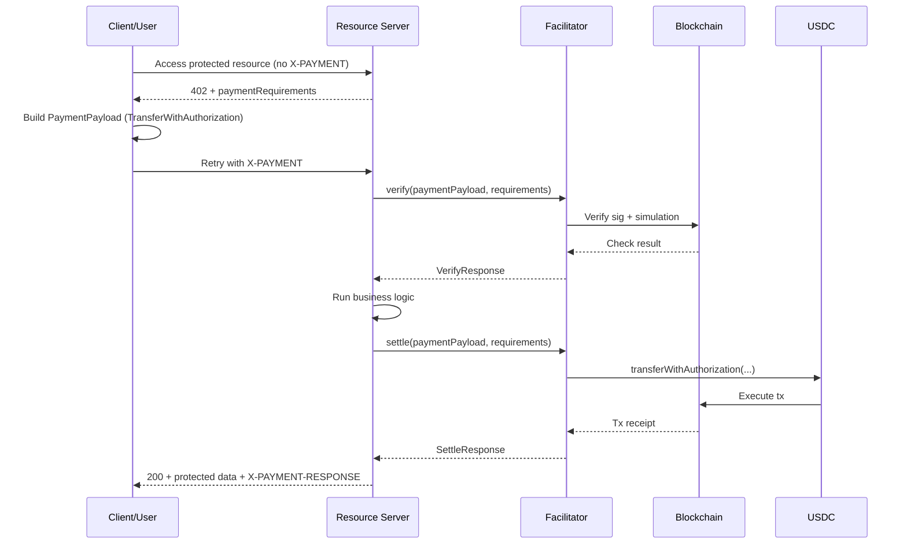
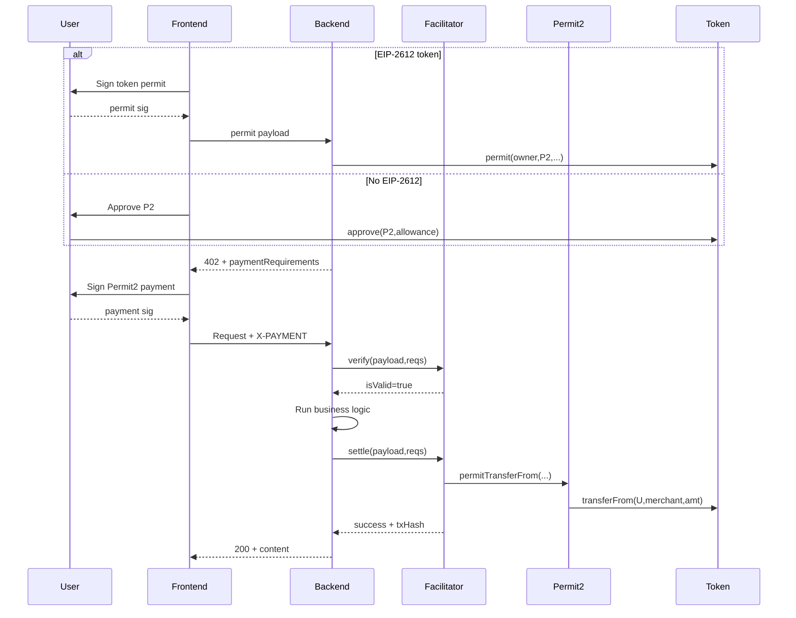

## x402 Architecture and End-to-End Flow

### Core Roles

x402 is split into three responsibilities:

- **Client**: receives payment requirements, selects one option, produces a signed `PaymentPayload`.
- **Resource Server**: decides which routes are paid, generates `PaymentRequired`, verifies and settles payments before/while serving business data.
- **Facilitator**: chain-aware payment processor exposing `/supported`, `/verify`, and `/settle`; performs signature checks, simulation, and final on-chain settlement.

### Protocol Objects

The flow is built around a few objects:

- **`PaymentRequired`**: server quote/challenge.  
  Contains `accepts[]`, where each item is a payable option (`scheme`, `network`, `asset`, `amount`, `payTo`, etc.).
- **`PaymentPayload`**: client’s selected and signed payment data.
- **`VerifyResponse`**: whether the payment is valid and executable.
- **`SettleResponse`**: whether on-chain settlement succeeded, with tx metadata.

- **v2**: `PAYMENT-SIGNATURE`, `PAYMENT-RESPONSE`
- **v1**: `X-PAYMENT`, `X-PAYMENT-RESPONSE`

### EVM Verify/Settle

A key idea is **two-phase payment handling**:

- `verify` = “this payment is valid and should work”
- `settle` = “this payment has been executed on-chain (or failed with reason)”

On EVM, `ExactEvmScheme` is the router that chooses the branch based on payload shape.

- **EIP-3009:** The token contract natively supports signature-based transfers, so the facilitator settles by calling `transferWithAuthorization`. Only a limited set of tokens support this (for example, USDC).
- **Uniswap Permit2:** Users authorize the Permit2 contract to spend their tokens up to a specified allowance. With **EIP-2612**, users can grant that token allowance via an off-chain `permit` signature (no separate on-chain `approve` transaction needed).
  
#### Verify

For both Permit2 and EIP-3009 branches, verify typically includes:

- Scheme/network consistency checks
- Recipient/amount/time-window checks
- EIP-712 signature validation
- On-chain simulation (`eth_call`) for executability
- Failure diagnosis to return specific `invalidReason` values

This is why failures are often actionable (insufficient balance, missing allowance, expired auth, nonce used, etc.) instead of generic errors.

#### Settle

Settlement usually does:

1. Re-verify (optionally with/without simulation based on config)
2. Submit transaction(s)
3. Wait for receipt
4. Return normalized `SettleResponse` with `success`, `transaction`, and error reason when needed

Branch specifics:

- **Permit2** can settle directly, or via EIP-2612 / ERC20-approval sponsorship flows.
- **EIP-3009** can optionally deploy undeployed smart wallets through ERC-6492-related logic before transfer.

#### The Permit2 Path

